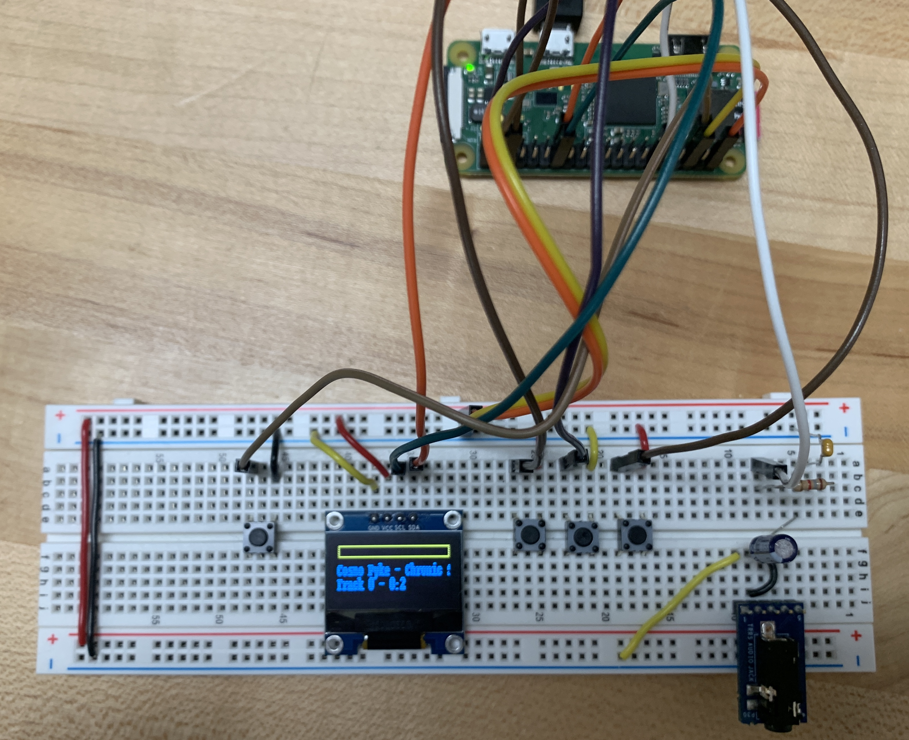
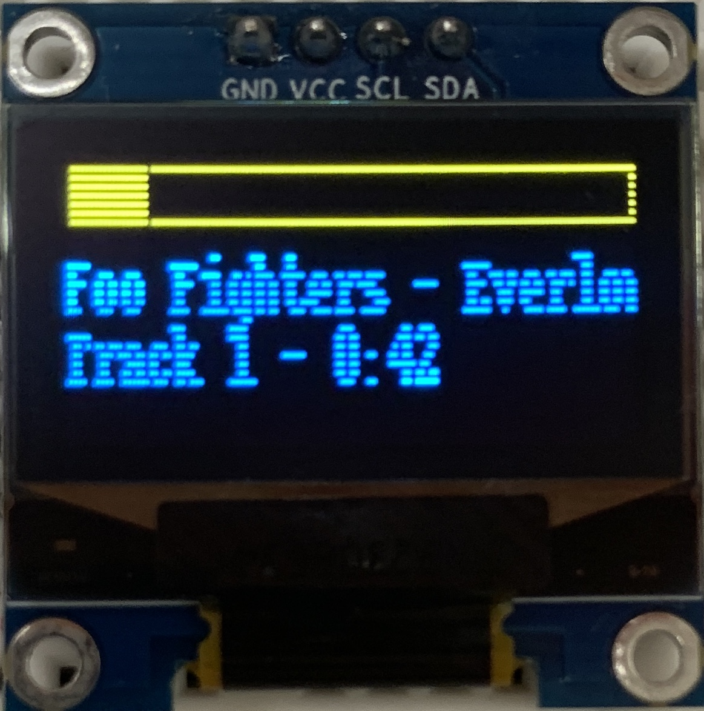

# Pi Music Player

This repository contains the code and setup instructions for a Raspberry Pi-based
music player.
The player is a Python script that runs as a Linux systemd service which
connects to a small OLED display and a button pad.

A breadboard implementation is pictured below



The button to the left of the display powers the board on/off,
the buttons on the right of the display select the next/previous song
and play/pause the song.

An example picture of the display is shown below.



The bar at the top shows how far through the song the player is,
the text in the middle shows the song title, and the text
at the bottom shows which track number is playing and the current
position in the song in seconds.

## Programming the Pi Zero

**Step 1**: flash the SD card with Raspberry Pi OS Lite using the [Pi Imager](https://www.raspberrypi.com/software/) software

- After choosing the storage device, click 'next' and select the 'custom config' option

- Set the username to 'pi', and set the locale and keyboard settings

- Enable SSH under Services > SSH and add your SSH key

**Step 2**: configure the boot settings

- Navigate to the `bootfs` partition on the SD card and add the following lines to `config.txt`:

```
dtoverlay=dwc2
dtparam=i2c_vc=on
audio_pwm_mode=2
dtoverlay=audremap,pins_18_19
```

- Then add the following line after `rootwait` in `cmdline.txt`, leaving any text after it untouched

```
modules-load=dwc2,g_ether
```

**Step 3**: boot the Pi and connect over Ethernet

- Plug in the SD card and plug the Pi into your computer

- Booting the first time will take about 5-10 minutes

- Once done you should see a device in your network manager that looks
something like "Ethernet over USB" or "RNDIS Ethernet Gadget"

**Step 4**: setup the device

- Install all the libraries and do the necessary config by doing

```
make setup
```

- This will run `raspi-config` at the end, and you will have to manually
enable I2C (Interface Options > I2C) and audio out from headphones jack (System > Audio),
and enable login at boot (System > Boot/Auto Login)

- To upload `.wav` files from `./music` to the device, run the command

```
make load_music
```

**Step 5**: upload code and start service

- To upload the python code to the device run

```
make program
```

- Then to start the code as a service run

```
make start
```

- Run these two commands anytime code is changed

- If you want to run the code in an interactive session to test it first, run

```
make test
```

- To clear out code files and stop service, run

```
make clean
```

## Sources

- [SSH to Pi Zero over USB](https://artivis.github.io/post/2020/pi-zero/)

- [GPIO setup and pin map](https://gpiozero.readthedocs.io/en/stable/recipes.html)

- [Sox Linux audio player](https://manpages.ubuntu.com/manpages/jammy/man1/sox.1.html)

- [Sending audio to GPIO](https://retropie.org.uk/forum/topic/32513/cannot-set-audio-to-heaphones-on-raspberry-pi-zero-2-w/4)

- [Python script as service](https://gist.github.com/emxsys/a507f3cad928e66f6410e7ac28e2990f)

- [Connect to eduroam WiFi](https://www.instructables.com/Connect-Raspberry-Pi-to-College-WIFI/)

- [Adafruit OLED display](https://github.com/adafruit/Adafruit_Python_SSD1306)

- [Adding a power button](https://howchoo.com/pi/how-to-add-a-power-button-to-your-raspberry-pi/)

- [Enabling second I2C bus](https://woodgears.ca/tech/i2c.html)
